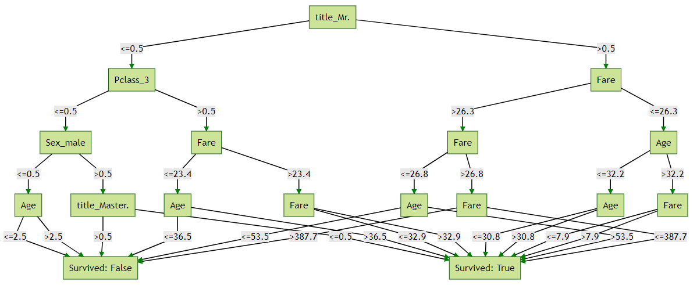

# Motivation
Random forest (rf) has been traditionally under-used in a variety of industries due to linear models being more explainable; this is despite ensemble methods (which includes GBM & rf) consistently outscoring linear models in kaggle competitions. This repo aims to plug the gap by providing an easy way to visualize both Random Forest Classification and Random Forest Regression.  

# decision-tree-dash
A Decision tree vis with outputs looking like 
